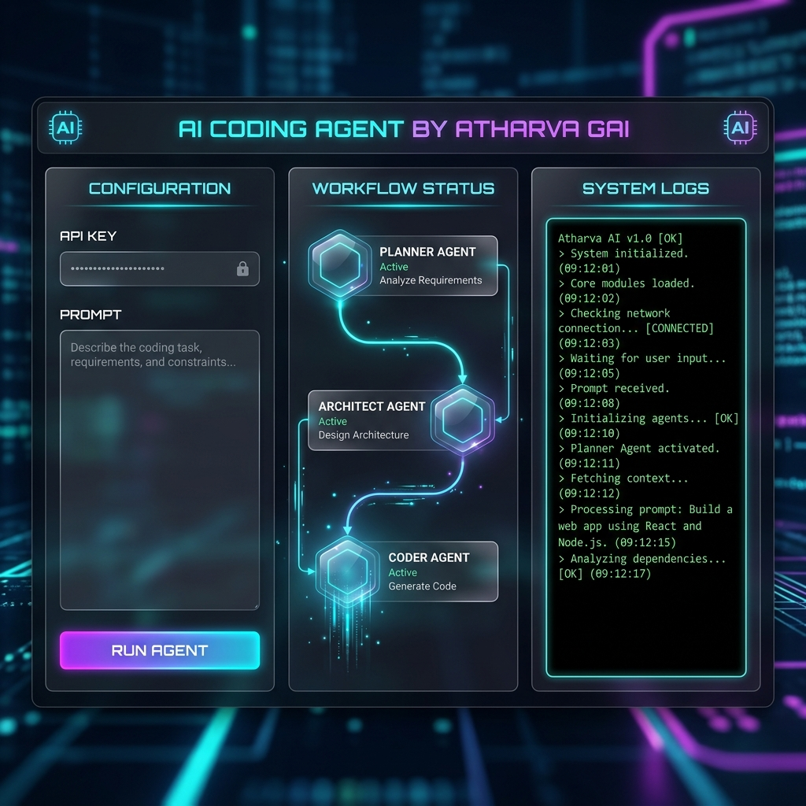

<p align="center">
  
</p>

<h1 align="center">
  <span style="color: #00f0ff;">⚡ AI Coding Agent ⚡</span>
</h1>

<h3 align="center">
  <em>A cutting-edge, futuristic auto-coding dashboard by <strong>Atharva Gai</strong>.</em>
</h3>

<p align="center">
  <a href="#features"></a>
  <a href="#installation"></a>
  <a href="#architecture"></a>
</p>

---

## 🌌 The Dashboard

Step into the future of development. This project replaces traditional CLI-based AI generation with a **glowing, immersive glassmorphism web dashboard**.

<p align="center">
  
</p>

<kbd>No Scrolling Required</kbd> · <kbd>Everything in One Frame</kbd> · <kbd>Live WebSockets</kbd>

---

## ✨ Dazzling Features

- 🟢 **Live LangGraph Visualizer**: See the AI's "thought process" loop visually between the **Planner**, **Architect**, and **Coder**!
- 💨 **Real-Time Streaming**: Watch code creation events stream automatically from the backend directly to the front-end embedded terminal.
- 🎨 **Futuristic UI**: Tailored specifically with neon cyan `#00f0ff` and deep purple `#7000ff` lighting with ultra-modern glass CSS effects.
- 🔒 **Secure Keys**: Never put your API keys in the code again; input them securely in the sleek frontend widget safely in your local instance.

---

## 🛠️ Tech Stack Integration

<div>
  <ul>
    <li><b>Backend Core:</b> <code>FastAPI</code>, <code>uvicorn</code>, <code>websockets</code></li>
    <li><b>AI Brain:</b> <code>LangGraph</code>, <code>LangChain</code>, <code>Groq (Mixtral-8x7b)</code></li>
    <li><b>Frontend Skin:</b> Vanilla JS/HTML5 with custom Glassmorphism CSS</li>
  </ul>
</div>

---

## 🚀 Quick Start Instructions

Get this running on your local machine in under **60 seconds**.

### 1. Requirements 
- Install `Python >= 3.11`.
- Get a [Groq API Key](https://console.groq.com/keys) (No `.env` required).
- Install Astral's `uv`.

### 2. Setup
Clone the repository, then synchronize the environment:
```bash
# Sync dependencies
uv sync 
# or use pip
pip install fastapi uvicorn websockets langgraph langchain langchain-groq groq pydantic
```

### 3. Ignite 🚀
Spin up the FastAPI core with server-sent events:
```bash
uvicorn app:app --reload
```
🔥 Open [http://localhost:8000](http://localhost:8000) and step into the Cockpit! 

---

<p align="center">
  <i>"Redefining workflow automation."</i><br>
  Built and Personalized by <b>Atharva Gai</b>.
</p>
