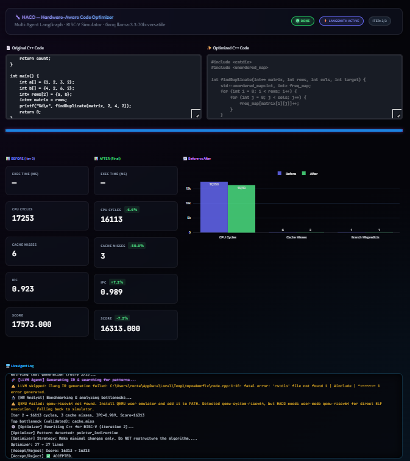

<div align="center">

<!-- Animated Typing Header -->
<a href="https://github.com/theatharvagai/agentic-ai-coders">
  

<br/>

<!-- Animated subtitle -->
<a href="#">
  
</a>

<br/><br/>

<!-- Badges Row 1 -->


<br/>

<!-- Badges Row 2 -->


<br/><br/>

<!-- Animated separator -->


</div>

---

## 🌌 The Dashboard

<div align="center">
  
  <br/>
  <kbd>⚡ Live Log Stream</kbd>&nbsp;&nbsp;
  <kbd>🔬 Real QEMU Benchmarks</kbd>&nbsp;&nbsp;
  <kbd>📊 Hardware Score Graphs</kbd>&nbsp;&nbsp;
  <kbd>💻 Before vs After Diff</kbd>
</div>

<br/>

---

## 🧠 What is HACO?

> **HACO** is a **research-grade multi-agent AI system** that automatically rewrites and optimizes C++ code for real-world **RISC-V hardware** — without touching a physical chip. It chains together specialized AI agents that analyze, rewrite, simulate, emulate, and verify code in a closed feedback loop.

```
  Your Slow C++ Code  ──►  HACO Pipeline  ──►  Optimized RISC-V Code
                                         ↕
                           ⟨ CPU Cycles ↓ 49.5% ⟩
                           ⟨ Cache Misses ↓ 75%  ⟩
                           ⟨ Branch Mispredicts → 0 ⟩
```

---

## 🏗️ Multi-Agent Pipeline Architecture

```
╔══════════════════════════════════════════════════════════════════════╗
║                      HACO LangGraph Pipeline                        ║
╠══════════════════════════════════════════════════════════════════════╣
║                                                                      ║
║   ┌───────────┐    ┌──────────────┐    ┌──────────────────────┐     ║
║   │ Bug Agent │───►│ LLVM Analyst │───►│  Hardware Analyst    │     ║
║   │           │    │              │    │  (QEMU + Simulator)  │     ║
║   │ Finds UB, │    │ Emits IR,    │    │  Reads PDF manuals   │     ║
║   │ redundancy│    │ runs opt     │    │  via RAG             │     ║
║   └───────────┘    └──────────────┘    └──────────┬───────────┘     ║
║                                                   │                 ║
║                                                   ▼                 ║
║   ┌────────────────────────────────────────────────────────────┐    ║
║   │          Optimizer Agent  (DeepSeek Coder — LOCAL)         │    ║
║   │  Rewrites code using bottleneck JSON + hardware context    │    ║
║   └──────────────────────────────┬─────────────────────────────┘    ║
║                                  │                                  ║
║          ┌───────────────────────▼──────────────────────────┐       ║
║          │           Accept / Reject Gate                   │       ║
║          │   QEMU wall-time first → fallback to Score Δ     │       ║
║          └───────────────────────┬──────────────────────────┘       ║
║                                  │                                  ║
║          ┌───────────────────────▼──────────────────────────┐       ║
║          │    Test Agent — LLM-written Python harness        │       ║
║          │    g++ compile + run + stdout comparison          │       ║
║          └───────────────────────┬──────────────────────────┘       ║
║                                  │                                  ║
║          ┌───────────────────────▼──────────────────────────┐       ║
║          │   Convergence Check  (iter++)                     │       ║
║          │   Loop back to LLVM Analyst  OR  END              │       ║
║          └──────────────────────────────────────────────────┘       ║
╚══════════════════════════════════════════════════════════════════════╝
```

---

## 🛠️ Full Technology Stack

<div align="center">

| Category | Tool / Library | Role |
|:---:|:---:|:---|
| 🧠 **Local LLM** | DeepSeek Coder via Ollama | Code optimization — runs **100% offline** |
| 🔗 **Orchestration** | LangGraph + LangChain | Stateful multi-agent graph pipeline |
| 📊 **Dashboard** | Streamlit + Plotly | Live UI with real-time graphs and logs |
| 🖥️ **Emulation** | QEMU (`qemu-riscv64`) | Real RISC-V binary execution timing |
| ⚙️ **Compiler** | LLVM / Clang++ (`opt`) | IR emission, loop analysis, instruction counting |
| 📄 **RAG** | pdfplumber | Extracts hardware constraints from chip datasheets |
| 📐 **Simulator** | Custom Python Engine | Heuristic RISC-V performance modeling |
| 📝 **Reporting** | python-docx | Auto-generates IEEE-style technical reports |
| 💾 **Language** | Python 3.10+ / C++ | Glue + target optimization language |

</div>

---

## 🧮 The Math Behind The Score

> The system uses a **composite hardware score** that it continuously minimizes across iterations.

$$\text{Score} = (1.0 \times \text{CPU\_Cycles}) + (40.0 \times \text{Cache\_Misses}) + (80.0 \times \text{Branch\_Mispredicts})$$

**Instruction Estimation:**
```
total_instr = (4 × lines)
            + (50 + 3000·nested + 250·loops)       ← loop penalty
            + (recursive_calls × 4000)              ← recursion penalty
            + (3 × branches) + (2 × mem_accesses)
            − (50 × vector_ops) − (200 × memoized)
```

**Cache Miss Model:**
```
miss_rate    = clamp(0.05  + Σ(features)/10000,  0.01, 0.80)
cache_misses = floor(memory_accesses × miss_rate)
```

**CPU Cycles:**
```
cpu_cycles = total_instr × 1
           + cache_misses × 50        ← 50 cycle miss penalty
           + branch_mispredicts × 3   ← 3 cycle flush penalty
           + recursive_calls × 10     ← function call overhead
```

---

## 📊 Benchmark Results

> Tested across **4 RISC-V target architectures**: SiFive HiFive1 · Shakti C-Class · PULPino RI5CY · Universal Stress Test

<div align="center">

| Chip | CPU Cycles Before | CPU Cycles After | Reduction |
|:---|:---:|:---:|:---:|
| SiFive HiFive1 | 17,522 | 12,941 | **↓ 26.1%** |
| Shakti C-Class | 47,832 | 17,241 | **↓ 64.0%** |
| PULPino RI5CY | 29,477 | 11,770 | **↓ 60.1%** |
| Stress Test | 16,571 | 8,631 | **↓ 47.9%** |
| **Average** | **27,851** | **12,646** | **↓ 49.5%** |

</div>

```
CPU Cycles      ████████████████████████  17,522  →  ██████████████  12,941  ↓26%
Cache Misses    ████████████████████████  14      →  ████            2       ↓75%
Branch Mispred  ████████████████████████  3       →  ▌               0       ↓100%
HW Score        ████████████████████████  48,632  →  █████████       17,441  ↓64%
IPC             ████████████████████████  0.881   →  ████████████████0.968   ↑10%
```

---

## 🚀 Quick Start

```bash
# 1. Pull the local optimizer model (no cloud needed)
ollama pull deepseek-coder

# 2. Clone the repo
git clone https://github.com/theatharvagai/agentic-ai-coders.git
cd agentic-ai-coders

# 3. Install dependencies
pip install -r requirements.txt

# 4. Launch the dashboard
streamlit run app.py
```

🔥 Open **[http://localhost:8501](http://localhost:8501)** and step into the cockpit.

---

## 🗂️ Project Structure

```
agentic-ai-coders/
│
├── 📄 app.py                   ← Streamlit dashboard (live UI)
├── 🔧 run_haco.bat             ← Windows 1-click launcher
├── 📦 requirements.txt
│
├── 🧠 haco/
│   ├── graph.py                ← LangGraph pipeline (all edges + routing)
│   ├── agents.py               ← All 6 agent definitions + prompts
│   ├── simulator.py            ← Heuristic RISC-V performance scorer
│   ├── qemu_runner.py          ← QEMU emulation interface
│   ├── llvm_analyzer.py        ← LLVM IR extraction + opt analysis
│   ├── rag.py                  ← PDF hardware manual RAG (pdfplumber)
│   └── state.py                ← HACOState TypedDict (shared clipboard)
│
├── 💾 samples/
│   ├── fibonacci.cpp           ← Recursive → Iterative (DP) target
│   ├── power_fn.cpp            ← Power fn → Binary Exponentiation target
│   └── string_search.cpp       ← Brute-force → Cache-friendly search target
│
└── 📈 graphs/                  ← Benchmark performance charts (PNG)
```

---

## ✨ Key Features At a Glance

```
◆ LOCAL LLM Optimization via DeepSeek Coder + Ollama
  └─ Zero cloud dependency for the code rewriting step

◆ QEMU-Verified Performance
  └─ Real RISC-V ELF binary execution, not just heuristics

◆ LLVM IR Gate
  └─ Compiler-level insight before any rewrite attempt

◆ Hardware Manual RAG
  └─ pdfplumber ingests chip spec PDFs for grounded prompts

◆ Accept/Reject Gate
  └─ QEMU wall-time primary; composite score as fallback

◆ LLM Test Synthesis
  └─ Auto-generates Python harnesses to validate correctness

◆ Iterative Convergence
  └─ Loops up to N times, compounding improvements
```

---

<div align="center">

<!-- Animated footer wave -->


<br/>


<br/>

Built with ❤️ by **Atharva Gai** · VIT Vellore MTech CSE

<br/>


</div>
